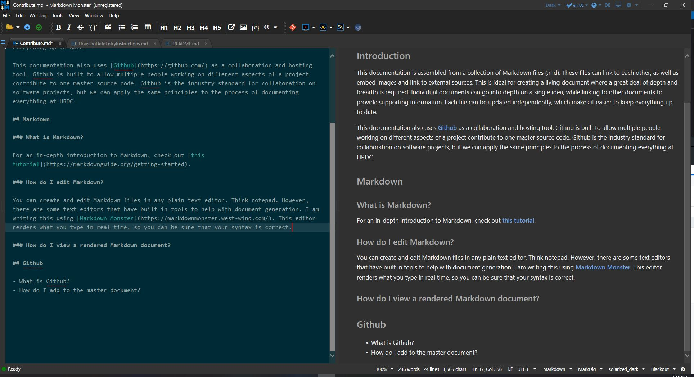

[Documentation Home](../README.md)

# Contributing to this documentation

- [Introduction](#introduction)
- [How to Contribute](#how-to-contribute)
   - [Write Markdown Documents](#write-markdown-documents)
   - [Git](#git)

## Introduction

This documentation is assembled from a collection of Markdown files (.md). The document you are reading right now was written using Markdown. Markdown files can link to each other, contain embedded images, and link to external sources. This is ideal for creating a living document where a great deal of depth and breadth is required. Individual documents can go into depth on a single idea, while linking to other documents to provide supporting information. Each file can be updated independently, which makes it easier to keep everything up to date.

This documentation also uses [Github](https://github.com/) as a collaboration and hosting tool. Github is built to allow multiple people working on different aspects of a project contribute to one set of master source code. Github is the industry standard for collaboration on software projects, but we can apply the same principles to the process of documenting everything at HRDC. Github also supports the use of Markdown files for writing project READMEs. Markdown files viewed on Github are automatically shown in their rendered (i.e. pretty) state.

---
---

## How to Contribute

Making contributions follows this basic workflow. The goal of this article is to give instructions on every step of the process, ***but you do not need to master each of these steps to make a contribution***. The Data and IT team will be available to help you along the way.

1. Identify changes that need to be made in the master documentation.
1. Make a branch of the master using Git.
1. Make edits to the individual files that need to be changed.
1. Commit those changes to the branch.
1. Merge the branch back into the master documentation.

### Write Markdown Documents

The biggest part of any contribution is just getting your thoughts on the page. Markdown helps you by taking out all the hassle of making the formatting just right in Microsoft Word. Instead of worrying about what font size is appropriate for a header, you can create them by just adding a single character. Check out the [syntax guide](markdownguide.md) for an overview, or for an in-depth introduction check out [this tutorial](https://markdownguide.org/getting-started).

### How do I edit Markdown?

You can create and edit Markdown files in any plain text editor, like Notepad. However, there are some text editors that have built in tools to help with document generation. I am writing this using [Markdown Monster](https://markdownmonster.west-wind.com/). This editor renders what you type in real time, so you can be sure that your syntax is correct. Markdown Monster also has built-in tools to help you generate links and embed images.

I recommend choosing your editor based on what you are trying to accomplish. If you are simply updating information in the body of an article, Notepad is probably sufficient. If you are working on multiple interdependent documents then Markdown Monster is probably a better choice.

### Git

You ***do not*** need to be an expert in Git to contribute to the HRDC documentation. The [HRDC Git Guide](gitguide.md) gives a high level overview of what Git is and what it does, for curious readers.

If you want to contribute to the master documentation, but you just cannot get your mind around Git, there will be help available.

