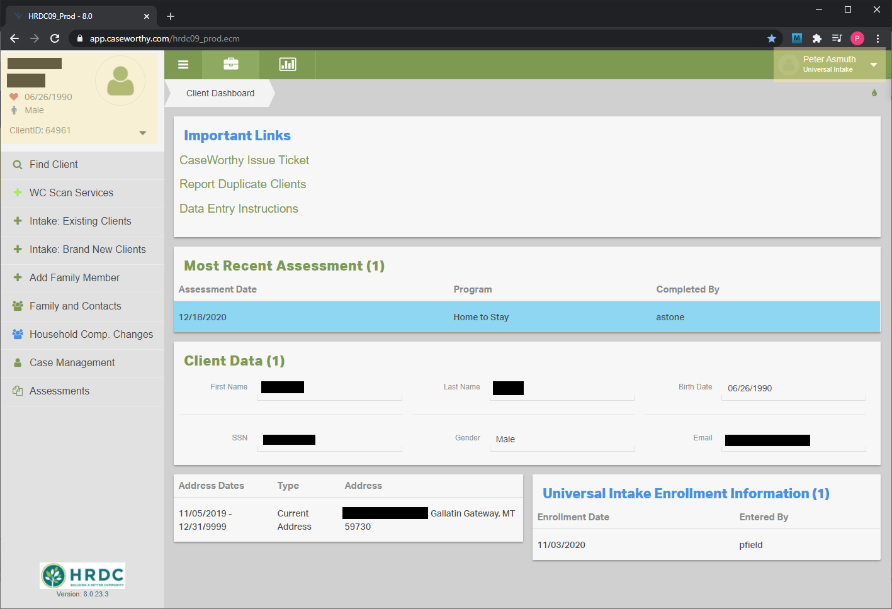

<a href="https://github.com/Pasmuth/CaseWorthy-Documentation.git" target="_blank">Documentation Home</a>

# Housing Data Entry Instructions

## Table of Contents

1. [Before You Start](#before-you-start)
   1. General Information
   1. Daily Support Session
1. [Basic Navigation](#basic-navigation)
1. [Finding Clients](#finding-clients)
1. [Brand New Clients](#brand-new-clients)
1. [Existing Clients](#existing-clients)
1. [Assessments](#assessments)
   1. Updating Client Assessments
1. [Household Composition Changes](#household-composition-changes)
1. [Case Management Tools](#case-management-tools)

## Before You Start

You can access CaseWorthy from any computer with an internet connection. The link can be found below. You may find it useful to bookmark this link for future reference.

<a href="https://app.caseworthy.com/hrdc09_prod.ecm" target="_blank"> https://app.caseworthy.com/hrdc09_prod.ecm</a>

It is recommended that you use Google Chrome, but you can also use Firefox or Edge. You CANNOT use CaseWorthy with Internet Explorer.

To obtain login credentials, contact your manager.

---
---

## Basic Navigation 
[\[Back to Top\]](#table-of-contents)

When you navigate to the CaseWorthy URL, you are greeted with this login screen. To continue, enter you Username and Password. If this is your first time logging in you may be asked to change your password. 

Once you login, you will see your user information displayed in the top-right corner of the screen. Directly below your name will be your current role. In this example you can see that Peter Asmuth is logged in, and my selected role is Universal Intake. Clicking on the arrow in the corner will allow you to change your role or log out of CaseWorthy.

Current client information is displayed in the top-left corner. When you log in the current client will default to the last client you had selected before you logged out.

### Client Dashboard

The first thing you see when looking at a client record is the Client Dashboard. The dashboard contains information on the current client, as well as some helpful links. (The link to this guide is one of them)

#### Dashboard Elements
- Important Links
  - CaseWorthy Issue Ticket
  - Report Duplicate Clients
  - Data Entry Instructions (this guide)
- Most Recent Assessment
  - The Most Recent Assessment widget shows how fresh the data is on a given client. It displays the date of the last assessment, the program that collected it, and the user that entered it. The information will display in different colors based on the age of the assessment.
    - Less than 3 months: Blue
    - 3-6 months: Orange
    - \>6 months: Red
- Client Data
  - The client data widget displays some basic personal identifying information
- Address History
- Universal Intake Enrollment
  - This widget shows the Universal Intake enrollment information.

---
---

## Finding Clients 
[\[Back to Top\]](#table-of-contents)

To find clients, click the "Find Client" menu item on the left. This will open a form that with several fields for personal information:

* First and Last Name
* Birthday
* Social Security Number
* Client ID

### Tips for Finding Clients

It is very important that there be only one client record per individual. Having duplicate clients causes confusion for people entering data, as well as data quality issues that affect reporting. Here are a few things to keep in mind when searching for clients to avoid duplicates.

#### Less is More 

All the fields on the find client form are optional. Using fewer search terms will cast a wider search net, returning more results. This is useful for finding potential duplicate clients. If you enter information in all the search fields, the database will not return any records unless the information you entered matches exactly to an existing client record. If the data was originally entered incorrectly, or if you are entering incorrect data, you could potentially miss a duplicate client. 

#### Substring Matching

Entering a shortened version of a client's name will also cast a wider net. For example, "And" would match with "Anderson" and "Andersen".

#### First Name, Date of Birth Search

There are some cases where a simple last name, first name search will miss duplicate clients. A first name, date of birth search is useful for finding clients that have changed their last names.

#### Keep Trying

You should always search in at least two different ways, but possibly more if the situation calls for it. Taking an extra 10 seconds to double or triple check might save you a headache down the road.

---
---

## Brand New Clients 
[\[Back to Top\]](#table-of-contents)

The intake process for brand new clients has a few basic components. 

- Collect Demographic information about the family/household
  - This includes names, DOBs, address history, race/ethnicity, etc.
- Begin their program enrollment with HRDC (Universal Intake) and with the housing programs (Home to Stay)
- Collect required intake data
  - This includes information on housing, employment, health insurance, etc.

The step-by-step below covers all the steps in detail
### Step-by-Step
To create a new client in CaseWorthy click the "Intake: Brand New Clients" button on the left navigation bar. This will start a new workflow, which is a series of forms that gather the required information about the client and their interactions with HRDC. Each of the list items below represents an individual form.

1. First, information about the head of household is collected on the [Client Demographics](../Forms/1000000004.md) form. This form contains fields for personal information, like their name, age and gender, as well as some contact and address information. Once all the required fields are complete, click "Save" at the bottom of the form to commit the changes, or "Cancel" if you decide not to. Clicking "Cancel" will end the workflow.
  - NOTE: If the client has no address you need to "Make Verify Address not Mandatory". Otherwise their address will be recorded as the Warming Center, which is not accurate.
1. After saving the client demographics, you will be prompted to update the client <a href="../Forms/1000000134.md" target="_blank">Address History</a>. For brand new clients this is usually limited to adding a mailing address. You only have to enter a mailing address if it is different from their physical address. 
1. The next form lets you <a href="../Forms/1000000131.md" target="_blank">Add Family Members</a>. The "+ Add Row" button creates a new set of fields for the personal information of a family member. Each new set of fields also come with its own duplicate check stored procedure, like the one on the first <a href="../Forms/1000000004.md" target="_blank">Client Demographics</a> form.
1. The <a href="../Forms/1000000246.md" target="_blank">Universal Intake Enrollment</a> creates an enrollment for the family we just created. The only field you need to fill is "Program Entry Date". "Intake Completed By" will default to the user entering the data, but it can be changed if somebody is doing data entry on behalf of somebody else.
1. The <a href="../Forms/1000000259.md" target="_blank">Enrollment Members</a> form lets you select which household members will be tied to the enrollment created on the last form. For the Universal Intake enrollment, all household members should be added to the enrollment. Click the checkbox for each family member and verify that the program entry dates are all correct.
1. At this point you will be asked: "Complete assessments at this time?" If you have recent data available (which you should for a brand new client) you should say yes. You have the option of saying no and skipping the remaining steps of the intake, but this option should only be used if the complete data is not available and we need some sort of client record in the system. This will leave the enrollment status as "Assessments Pending". To complete them go to the <a href="../Forms/1000000266.md" target="_blank">Program Enrollment</a> form, and click on the assessments pending link. 
1. Once the enrollment is created and all the members are added, the workflow creates an <a href="Objects/Assessment.md" target="_blank">Assessment</a> for each client. The first set of forms you complete will collect Universal Intake data. These are data points that are required by all HRDC programs, including all the housing programs. 
    - The <a href="../Forms/1000000248.md" target="_blank">HUD Assessment</a> collects data on things like housing status, non-cash benefits received, employment status, and more. You will have to complete the <a href="../Forms/1000000248.md" target="_blank">HUD Assessment</a> for each enrolled member, but not all family members will be asked the same questions. 
    - The <a href="../Forms/1000000145.md" target="_blank">Financial Assessment</a> collects data on household income and its sources. Check each row that applies, enter the amount, and the interval. There are additional fields to record how and when the data was verified, but they are not required.
 1. Once all the assessment data is collected, you will be asked "Would you like to enroll members of this household into any additional programs?" Say yes to enroll the household in the housing programs.
 1. On the <a href="../Forms/1000000030.md" target="_blank">Enrollment Add/Edit</a> form select  "Home to Stay" under Program and use the same Program Entry Date that you used for the initial enrollment.
 1. You will have to select which family member to enroll again on the <a href="../Forms/1000000259.md" target="_blank">Enrollment Members</a> form.
 1. You will again be asked if you want to complete assessments, say yes. This will create a new set of <a href="Objects/Assessment.md" target="_blank">Assessment</a>s that will be tied to the housing enrollment. A lot of the data needed for housing overlaps with the data collected for the Universal Intake, but there are a few extra items that need to be added.
 1. You should be given the option to Copy Assessments. This will fill in all the data that you already entered for the Universal Intake.
     - The <a href="../Forms/1000000248.md" target="_blank">HUD Assessment</a> may ask for additional data depending on the family.
     - The <a href="../Forms/1000000262.md" target="_blank">Chronic Homelessness Assessment</a> collects more detailed information about the housing status of each family member. Data entered on this form determines if a client meets the HUD definition for chronic homelessness.
     - There are no additional questions on the <a href="../Forms/1000000145.md" target="_blank">Financial Assessment</a>, but you may be prompted to enter data on additional family members.
 1. This is the end of the workflow. Click "Done" when you are finished reviewing the summary of the forms you filled out.

---
---

## Existing Clients 
[\[Back to Top\]](#table-of-contents)

If you need to enroll a client or family that already exists in CaseWorthy the process is much simpler. Click the "Intake: Existing Clients" button on the left navigation bar. This launches a shorter workflow that focuses on enrollment and assessment data, and skips collecting some of the more general client demographics.

1. On the <a href="../Forms/1000000030.md" target="_blank">Enrollment Add/Edit</a> form select  "Home to Stay" under Program and enter the Program Entry date.
1. Select which family members to enroll on the <a href="../Forms/1000000259.md" target="_blank">Enrollment Members</a> form.
1. At this point you will be asked: "Complete assessments at this time?" If you have recent data available (which you should for a brand new client) you should say yes. You have the option of saying no and skipping the remaining steps of the intake, but this option should only be used if the complete data is not available and we need some sort of client record in the system. This will leave the enrollment status as "Assessments Pending". To complete them go to the <a href="../Forms/1000000266.md" target="_blank">Program Enrollment</a> form, and click on the assessments pending link. already entered for the Universal Intake.
1. Once the enrollment is created and all the members are added, the workflow creates an <a href="Objects/Assessment.md" target="_blank">Assessment</a> for each family member. 
   - The <a href="../Forms/1000000248.md" target="_blank">HUD Assessment</a> collects data on things like housing status, non-cash benefits received, employment status, and more. You will have to complete the <a href="../Forms/1000000248.md" target="_blank">HUD Assessment</a> for each enrolled member, but not all family members will be asked the same questions. 
   - The <a href="../Forms/1000000145.md" target="_blank">Financial Assessment</a> collects data on household income and its sources. Check each row that applies, enter the amount, and the interval. There are additional fields to record how and when the data was verified, but they are not required.
   - The <a href="../Forms/1000000262.md" target="_blank">Chronic Homelessness Assessment</a> collects more detailed information about the housing status of each family member. Data entered on this form determines if a client meets the HUD definition for chronic homelessness.
1. This is the end of the workflow. Click "Done" when you are finished reviewing the summary of the forms you filled out.

---
---

## Assessments 
[\[Back to Top\]](#table-of-contents)

An Assessment is simply a collection of data made by a specific program on a specific date. The assessments that you completed as part of the intake process are known as "At Entry" assessments, but there are also "During", "At Exit", and "Annual" assessments. To review a client's assessment history use the <a href="../Forms/1000000256.md" target="_blank">Assessment Summary</a> form from the left navigation bar. This form displays the date of the assessment, the assessment type, who collected the information, and for which program it was collected. Clicking the Action Gear on a row will allow you to review responses to specific assessment questions.

### Updating Client Assessments

It is important to regularly update our client data. It is a good rule of thumb to keep the data less than 6 months old. You can quickly identify if a client's data is older than that by the color coded Most Recent Assessment dashboard widget.

You can create a new assessment from the assessment summary form by clicking the "+ Add New" button in the top-right corner. This will launch the <a href="../Forms/1000000267.md" target="_blank">New Assessment</a> form. Select the program and assessment type, enter the date, and hit "Save". You will be directed to fill out the <a href="../Forms/1000000248.md" target="_blank">HUD Assessment</a> form, but you will have to go back to the assessment summary form to fill in values for the other assessment forms.

---
---

## Household Composition Changes 
[\[Back to Top\]](#table-of-contents)

1. Close the <a href="../Forms/1000000266.md" target="_blank">Program Enrollment</a>s for the family member to be moved.
1. Review the family history on the <a href="../Forms/1000000048.md" target="_blank">Client Families</a> form.
  - Make a new one
  - Move into an existing one

---
---
  
## Case Management Tools 
[\[Back to Top\]](#table-of-contents)

- Case Notes
- Services
- Alerts
- Documents
- Program Enrollment
- Program Attendance
   

