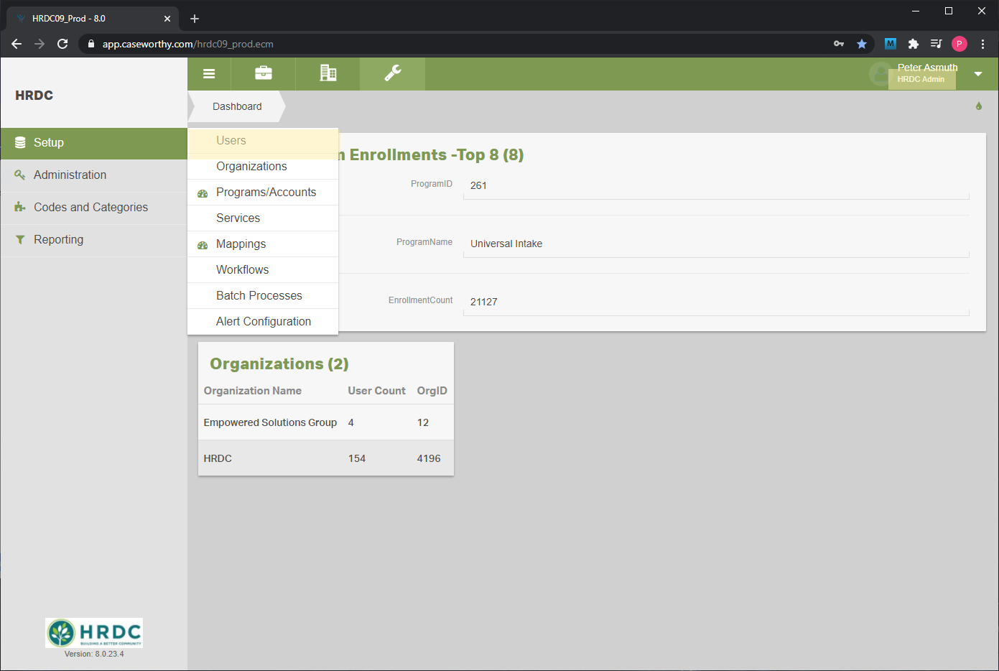
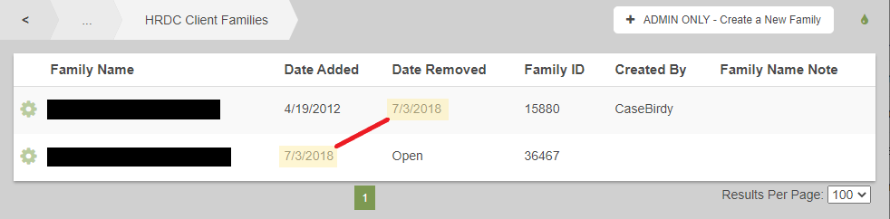
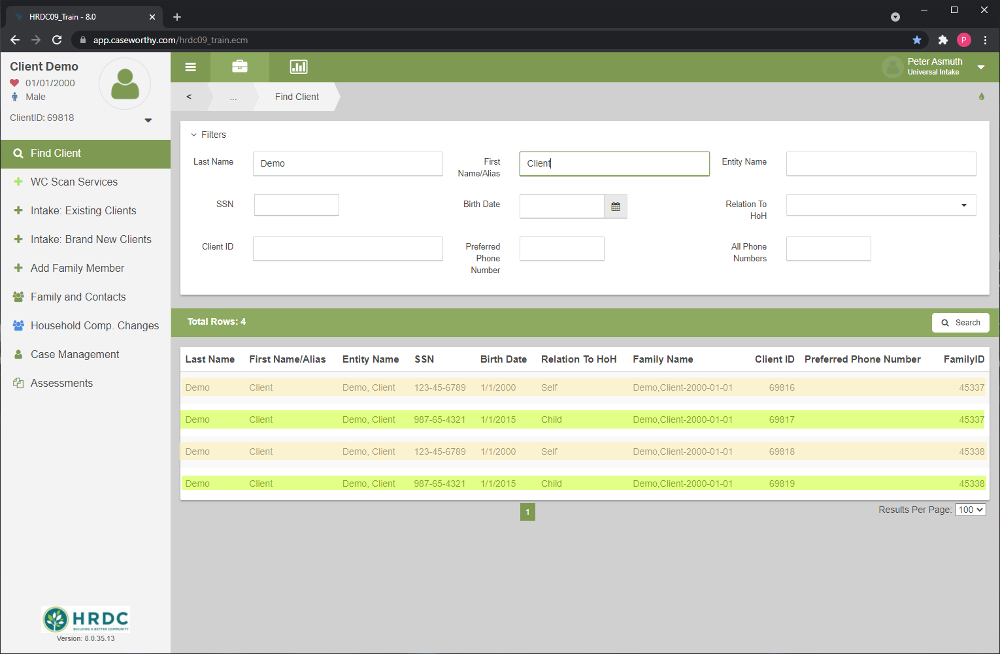
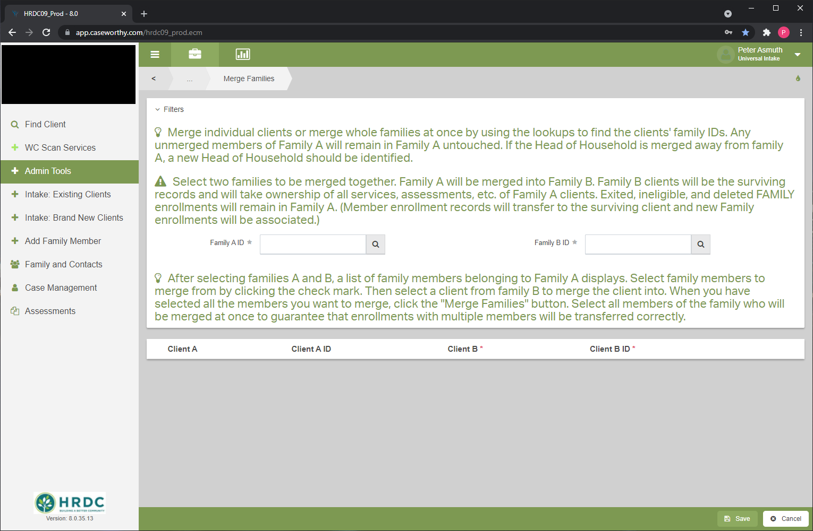

[Documentation Home](../README.md)

# CaseWorthy Administrator Instructions

This page will outline some of the basics of the day-to-day administration of CaseWorthy

1. Users
   1. Off-boarding
1. Household Composition Changes
1. Client Merges
1. Database Backups
1. SQL Server Management Studio (SSMS)
1. [Structured Query Language (SQL)](sql.md)
1. SQL Server Reporting Service (SSRS)
1. [`sqlGetter.py`](#sqlgetter.py)

---
---

## Users

Anybody at HRDC can access CaseWorthy with their manager's approval. It is generally a good idea to not provide login credentials until a new user has completed the introductory training.

### Where to configure users

You can create new users through the HRDC Admin role. Before creating a new user, do a search to make sure they do not already exist. This is done using the [Add User](../Forms/Baseline8.md) found on the [Users Summary](../Forms/Baseline7.md) form. Click-path shown below:



### Off-boarding

Once an employee leaves HRDC, their CaseWorthy privileges should be immediately revoked, unless otherwise specified. This is done by locking their account and making it inactive. This is accessed through the [Edit User](../Forms/Baseline8.md) form.

---
---

## Household Composition Changes

Sometimes clients need to be moved to different households. This section will cover the procedure for creating new households, moving clients into new households, and moving clients into existing households.

- View client family history with the [Client Families](../Forms/1000000048.md) form. Each row represents a family that this client has been a member of.



- Determine if the client needs to be moved into a new family or an existing family
  - For a new family use the [ADMIN ONLY - Create a New Family](../Forms/1000000202.md) form
  - For an existing family
    - Look up the head of household of the new family
    - Use the [Add Family Member Spreadsheet](../Forms/Baseline7114.md) on the left-nav bar to add the new family member
- Determine if any enrollments need to be transferred to the new family. Transfer enrollments when the client(s) moving to the new family is (are) the only enrollment member(s)
  - Transfer these enrollments to the new family ID using the [Edit Enrollment - Admin](../Forms/1000000111.md)
  
  
  
  
- Remove the client from program enrollments that are not being transferred using the [Program Enrollment](../Forms/1000000266.md) and [Add/Edit Members](../Forms/Baseline49.md) forms.
  - Change date from "Open" to the appropriate ending date.
  - Click path: Action gear - Member - "+ Add/Edit Members"


- If the client is moving back into an old family you can simply change the date added on that row to the appropriate date, and change the date removed to "Open".

In most cases, a client should only be in one family at a time. Make sure that the date added to the new family is the same as the date removed from the old family. The most notable exception to this is children in a joint custody situation. 


---
---

## Client Merges

When the same client is entered into CaseWorthy under two different client records they must be merged. The CaseWorthy client merge functionality is found on the left-nav bar in the Universal Intake role, under 'Admin Tools - Client Administration - Merge Clients - Add New'. Before using this form, it is wise to fully nail down which records are going to be merged into each other. At the end of the process one of the records will be deleted, and the other one will remain. 

Ways to determine how to merge:
- Record age: usually newer records should be merged into older ones
- Number of services/enrollments: records with fewer services should be merged into records with more
- Family members: if one family is missing family members, merge into the record with all family members

### Example merge

In this example, I will walk you through the process for completing a client/family merge. The first step is to determine which family should be merged into the other. Here we have two families, both with a head of household named "Client Merge Demo" and a child named "Client Child Demo", you can see how these results show up in a simple client search. The yellow highlighted rows are for "Client Merge Demo" and the greenish rows are for "Client Child Demo". You can see that they not only share the same name, but the exact birthday and Social Security number as well. This is pretty strong evidence that these files are, in fact, referring to the same people.



Figuring out which family should be merged into the other can be subjective. In this example one of the records (familyID: 45338) has 4 services associated with it, while the other one only has one (familyID: 45337). Otherwise, the two families are identical. For that reason, I am going to merge familyID 45337 into familyID 45338. 


Next, you need to use the [Merge Families](../Forms/1000000288.md) form to queue up the merge. There are some detailed instructions on the form itself, but the most important thing to remember is that "family A" will be merged into "family B". In our example that means we want to make familyID 45337 "family A" and familyID 45338 "family B". When you click on the form fields for the two families, it will pop-up a look up form, where you can search for the corresponding client. Once you have both families entered on the form, you need to check the rows for the clients you wish to merge. For each client you have to specify which client record in the destination family is correct, this is done by matching up the names. 



Once you save on the Merge Families form, you can see your merge process staged on the Client Merge Summary form (Admin Tools - Client Administration). To perform the merge, click the action gear for the record you want to process, and click "Process". A merge can take several minutes and during that time it may deadlock the rest of the application, for that reason it is wise to run client merges during non-working hours. 

## [Structured Query Language (SQL)](sql.md)
## SQL Server Reporting Service (SSRS)


## `sqlGetter.py`

`sqlGetter.py` is a module that allows you to establish a connection to a database and server. Import and instantiate the class to integrate it with your code

```python
# sqlGetter.py
import pyodbc
import pandas as pd

class Connection:
	def __init__(self, server, database):
		self.server = server
		self.database = database
		self.cnxn = self.connect()

	def connect(self):
		cnxn = pyodbc.connect('Trusted_Connection=Yes;DRIVER={ODBC Driver 17 for SQL Server};SERVER='+self.server+';DATABASE='+self.database)	
		print('Connection to {} established on {}'.format(self.database,self.server))
		return cnxn

	def pandize_data(self, query, string = False):
		if not string:
			path = query+'.sql'
			with open(path, 'r') as file:
				sql = file.read()
		else:
			sql = query
		return pd.read_sql_query(sql,self.cnxn)

```

```python
# yourPythonCode.py
from sqlGetter import Connection

server = 'YOUR SQL SERVER'
database = 'HRDC09_Prod'

# Create the Connection Object
cnxn = Connection(server, database)

# Use the built-in pandize_data() function from the Connection object
data = cnxn.pandize_data('SELECT * FROM Client', string = True) # Pass a literal query
other_data = cnxn.pandize_data('mysqlcode.sql') # Pass a path to a .sql file
```


### `connect(server, database)`

- Parameters
  - `server`: str
  - `database`: str
- Return Value
  - `cnxn`: pyodbc connection object


### `pandize_data(query)`

- Parameters
  - `query`: `str`,the name of the query to be used without the file suffix
    - e.g. `'clientdata'`
- Return Value
  - pandas dataframe object


