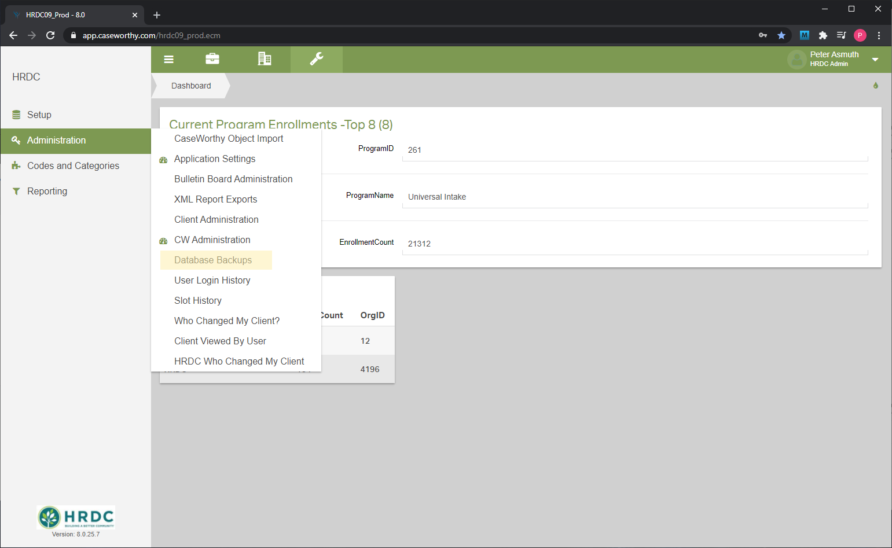
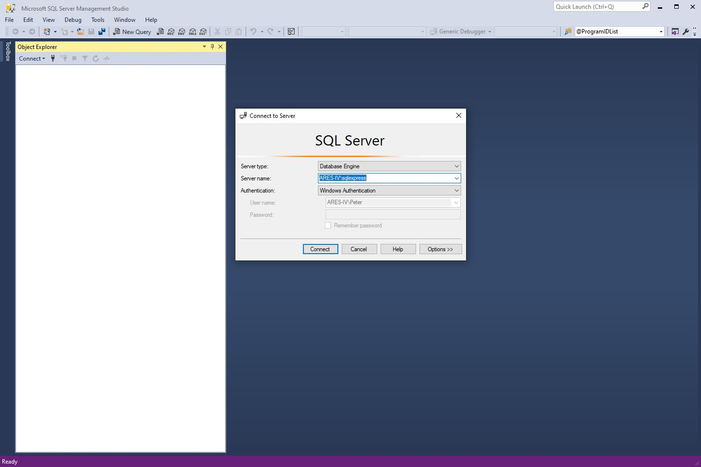

[Documentation Home](../README.md)

# CaseWorthy Administrator Instructions

This page will outline some of the basics of the day-to-day administration of CaseWorthy

1. Users
   1. Off-boarding
1. Household Composition Changes
1. Client Merges
1. Database Backups
1. SQL Server Management Studio (SSMS)
1. [Structured Query Language (SQL)](sql.md)
1. SQL Server Reporting Service (SSRS)

---
---

## Users

Anybody at HRDC can access CaseWorthy with their manager's approval. It is generally a good idea to not provide login credentials until a new user has completed the introductory training.

### Where to configure users

You can create new users through the HRDC Admin role. Before creating a new user, do a search to make sure they do not already exist. This is done using the [Add User](../Forms/Baseline8.md) found on the [Users Summary](../Forms/Baseline7.md) form. Click-path shown below:

### Off-boarding

Once an employee leaves HRDC, their CaseWorthy privileges should be immediately revoked, unless otherwise specified. This is done by locking their account and making it inactive. This is accessed through the [Edit User](../Forms/Baseline8.md) form.

---
---

## Household Composition Changes

Sometimes clients need to be moved to different households. This section will cover the procedure for creating new households, moving clients into new households, and moving clients into existing households.

- Close all open program enrollments for the client being moved using the .
  - Identify which enrollments need to be closed using the [Program Enrollment](..Forms/1000000266.md) form.
  - Click path: Left-Nav bar - Case Management - Program Enrollment
  - Close open enrollments using the [Add/Edit Members](../Forms/Baseline49.md) form.
    - Change date from "Open" to the appropriate ending date.
    - Click path: Action gear - Member - "+ Add/Edit Members"
- View client family history with the [Client Families](../Forms/1000000048.md) form. Each row represents a family that this client has been a member of.

- If the client needs to go into a new family you can create it with the [ADMIN ONLY - Create a New Family](../Forms/1000000202.md) form
- If the client is moving into an existing family pull up the file of the HoH of the family that the client is moving into. Add the client using the [Add Family Member Spreadsheet](../Forms/Baseline7114.md).
- If the client is moving back into an old family you can simply change the date added on that row to the appropriate date, and change the date removed to "Open".

In most cases, a client should only be in one family at a time. Make sure that the date added to the new family is the same as the date removed from the old family. The most notable exception to this is children in a joint custody situation. 

---
---

## Client Merges

<<<<<<< Updated upstream
Sometimes users will create duplicate clients. This necessitates the merging of client records. When two records are merged, all the services and enrollments from one client are transferred to another, and one of the client records can subsequently be deleted.
=======
### Layers of CaseWorthy

- CaseWorthy, the application
  - The CaseWorthy application is a web service that users can log into and enter and retrieve data. When you think of users using CaseWorthy, they are using the application layer
- CaseWorthy, the database
  - The application layer of CaseWorthy interacts with the database layer to perform basic CRUD (Create, Retrieve, Update, Delete) operations. Operations performed on the application layer generate SQL code that interacts with the database. There is no way for HRDC users to directly interact with the database layer.
- CaseWorthy, the corporation
  - CaseWorthy is also a corporate entity that manages and maintains the application and database layers.

CaseWorthy provides a full database backup on a nightly basis. These backups come in the form of a .bak file. You can find them under the HRDC Admin role, Administration tab, click-path shown below.

## SQL Server Management Studio (SSMS)

You can interact with local database backups using SQL Server Management Studio (SSMS). [Download SSMS here](https://docs.microsoft.com/en-us/sql/ssms/download-sql-server-management-studio-ssms?view=sql-server-ver15).

### Install a local SQL server

The first step in working with a local backup is to [download and install SQL Server 2019](https://go.microsoft.com/fwlink/?linkid=866662). This local server will mimic the SQL server that lives in the CaseWorthy data center.

### Connect via SSMS

When you open SSMS it will prompt you to connect to a SQL database server. In our case the server will be the one you installed on the previous step.

### Restore database from .bak
>>>>>>> Stashed changes

## [Structured Query Language (SQL)](sql.md)
## SQL Server Reporting Service (SSRS)

