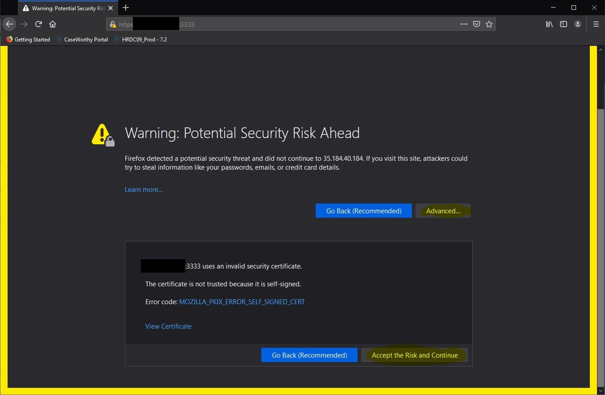

# Gophish

A free tool that allows you to simulate phishing attacks within the organization. This documentation will cover the basic operations of the software and include references to other related documentation.

## Reference Information

- [Gophish](https://getgophish.com/)
- [Official Documentation](https://getgophish.com/documentation/)
- [Github Repository](https://github.com/gophish/gophish)
- [Google Cloud Platform](https://console.cloud.google.com/)
- [Deploying Gophish on GCP](https://medium.com/illumination/deploying-a-gophish-server-on-google-cloud-platform-445eadaf8b31), a basic guide for getting the phishing server started on a GCP instance.
- [Simple Mail Transfer Protocol](https://en.wikipedia.org/wiki/Simple_Mail_Transfer_Protocol#:~:text=The%20Simple%20Mail%20Transfer%20Protocol,send%20and%20receive%20mail%20messages.) 
- [Mailjet](https://mailjet.com), has a free-tier SMTP that will be suitable for the volume we wish to have with this project.
- [Python Client](https://docs.getgophish.com/python-api-client/groups)
  - Gophish has a built in Python API that allows you to control the various functions of the package through Python code.

## Practical Step-by-step

- Go to the Google Cloud Platform console: [https://console.cloud.google.com]()
- Make sure your project is set to "Phishing Server"
- From the left-nav menu, go to "Compute Engine" and select "VM Instances"

- Check the status of "instance-2"
   - If it is running, do nothing
- If the instance is stopped or paused, start the instance
- Connect to the instance using "View glcoud command", or "Open in browser window"
- Run the following commands
  - `cd gophish` Changes the current directory (cd) to the folder named gophish
  - `sudo ./gophish` Runs the gophish application
  - OPTIONAL: `ls` lists all files and folders in the current directory
- Once the application is running, is should generate some console output similar to that which is shown below.

- Navigate to `https://<EXTERNAL IP OF VM INSTANCE>:3333`
  - The external IP address can be found in the VM instances overview
  - The first time you navigate to this address your browser should give you a security warning. You can safely ignore this warning since the IP and the software are both being managed by HRDC.
  - Click Advanced, then proceed to the server.
  - The options will be slightly different across browsers, but the Firefox version of the warning is shown below.
  

- Enter your username and password

