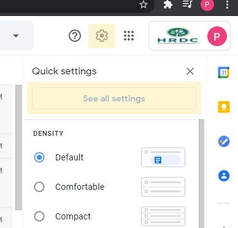
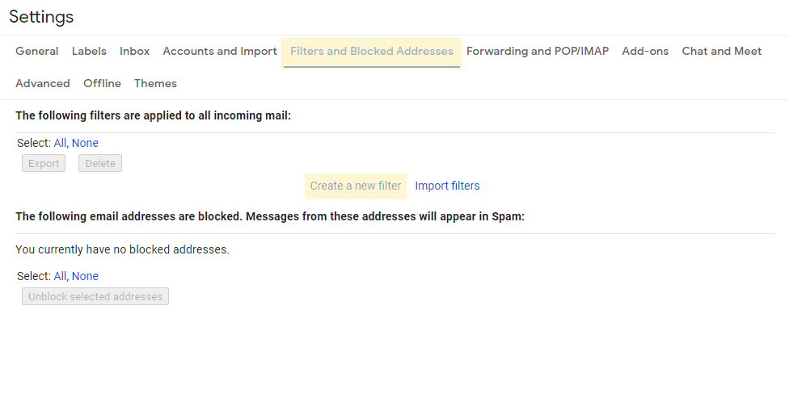
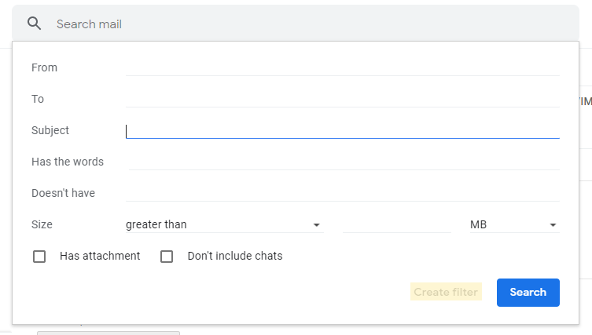
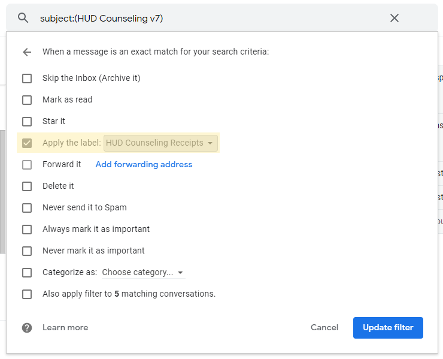
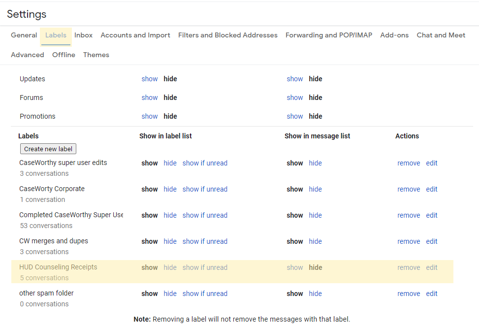

[Documentation Home](../README.md)

# Create an Inbox Filter

- Open the Gmail settings. Click the gear in the top right corner, then click "See all settings"

- Click "Filters and Blocked Addresses" and "Create a new filter"

- Enter your desired filter criteria and click "Create filter"

- After you create the parameters of your filter, you can decide what will happen to filtered messages. In this example, all messages with "HUD Counseling v7" will have the "HUD Counseling Receipts" label applied. In the drop-down where you choose a label you will also have the option of creating a new one.

### Show/Hide messages with label

- You can configure which labels show up and do not show up in your inbox. In the settings menu, click on the "Labels" tab. Scroll down to the bottom where your custom labels are listed, and select show or hide under "Show in message list"

