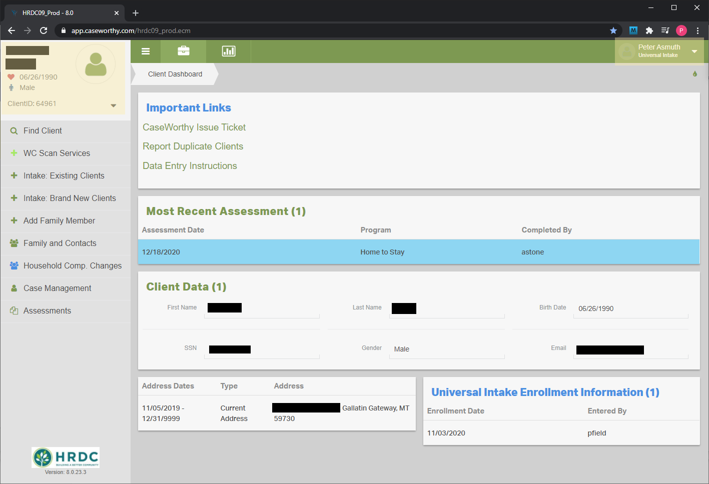

# Markdown Guide

1. [Basic Syntax](#basic-syntax)
1. [Documentation File Structure](#documentation-file-structure)

## Basic Syntax

Below is an example of Markdown Syntax. You can write almost any document with these commands.

```markdown
# This is a header
## This is a sub-header
### This is a sub-sub-header

1. This
1. Is a
1. Numbered List

* These
* Are
* Bullets
  * Indent by 2 spaces for sub-items

- Dashes
- Work
- Too

Three or more dashes creates a horizontal break

---
---

Embedding links is also very easy

Link to another document: [Documentation Home](../README.md)

Link to an external source: [Wikipedia](https://wikipedia.org)

Embed an image: 

```
---
The results of the above code is shown below:
# This is a header
## This is a sub-header
### This is a sub-sub-header

1. This
1. Is a
1. Numbered List

* These
* Are
* Bullets
  * Indent by 2 spaces for sub-items

- Dashes
- Work
- Too

Three or more dashes creates a horizontal break

---
---

Embedding links is also very easy

Link to another document: [Documentation Home](../README.md)

Link to an external source: [Wikipedia](https://wikipedia.org)

Embed an image: 

## Documentation File Structure

This documentation is comprised of dozens of individual Markdown files and images. It is important to know how each of these files fit together if you plan on contributing. The root of the entire project is the [README](../README.md).

### Basic Structure

```plain
|--README.md
|--Objects
|  |--[Documents about major CaseWorthy database objects]
|  |--Assessment.md
|  |--Client.md
|--Instructions
|  |--[User Intruction Manuals]
|  |--HousingDataEntryInstructions.md
|  |--Contribute.md
|  |--markdownguide.md (this document)
|--Images
|  |--[Screenshots]
|  |--clientdashboard.png
|--Forms
|  |--[Documents on individual CaseWorthy forms]
|  |--1000000004.md
|  |--1000000145.md
```