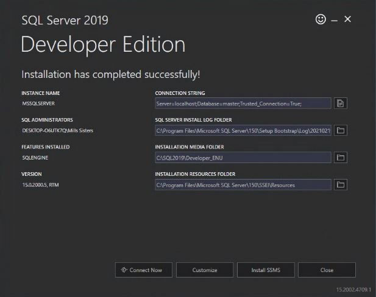
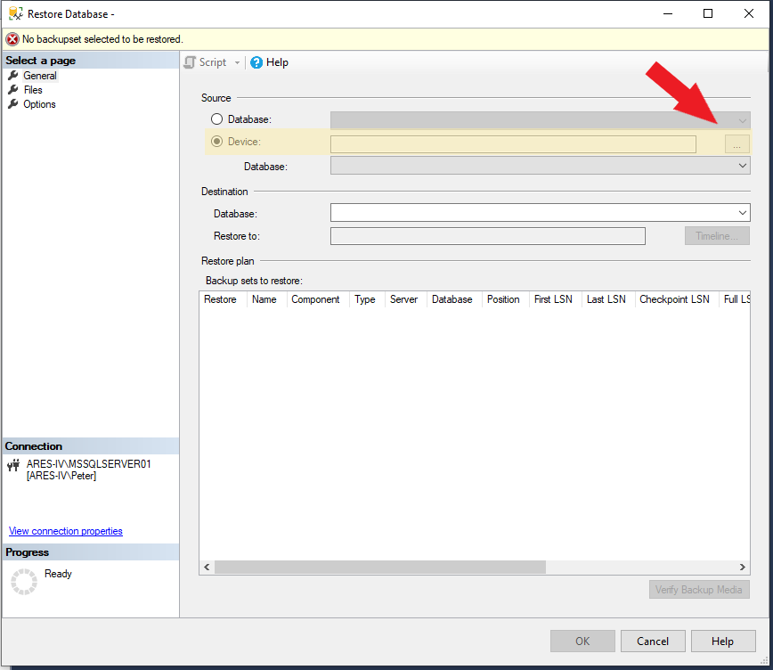

[Documentation Home](../README.md)

# Structured Query Language - SQL

1. [What is SQL](#what-is-sql)
1. [Database Back-end](#database-back-end)
1. [SQL Server Management Studio (SSMS)](#sql-server-management-studio)
1. [Databases and Tables](#databases-and-tables)
1. [Queries](#queries)

## What is SQL?
- SQL (pronounced sequel) stands for Structured Query Language
- It is a programming language that lets us pull data from (query) and manipulate databases.

## Database Back-end

### Layers of CaseWorthy

- CaseWorthy, the application
  - The CaseWorthy application is a web service that users can log into and enter and retrieve data. When you think of users using CaseWorthy, they are using the application layer
- CaseWorthy, the database
  - The application layer of CaseWorthy interacts with the database layer to perform basic CRUD (Create, Retrieve, Update, Delete) operations. Operations performed on the application layer generate SQL code that interacts with the database. There is no way for HRDC users to directly interact with the database layer.
- CaseWorthy, the corporation
  - CaseWorthy is also a corporate entity that manages and maintains the application and database layers.

CaseWorthy provides a full database backup on a nightly basis. These backups come in the form of a .bak file. You can find them under the HRDC Admin role, Administration tab, click-path shown below. Download the most recent database back up and save it to an easily accessed place on the C: drive.

## SQL Server Management Studio

You can interact with local database backups using SQL Server Management Studio (SSMS). 
<a href="https://docs.microsoft.com/en-us/sql/ssms/download-sql-server-management-studio-ssms?view=sql-server-ver15" target="_blank">Download SSMS here</a>.

### Install a local SQL server

The first step in working with a local backup is to [download and install SQL Server 2019](https://go.microsoft.com/fwlink/?linkid=866662). This local server will mimic the SQL server that lives in the CaseWorthy data center.

Run the downloaded file. This will open up an installer for SQL Server 2019.

Select "Basic" installation. This process takes about 10 minutes.

Make a note of the "Instance Name" when the installation is finished.

 
### Connect via SSMS

When you open SSMS it will prompt you to connect to a SQL database server. In our case the server will be the one you installed on the previous step. You must have administrator access in order to conect to the server. To connect select the down arrow on the server and hit browse for more. Then select local servers tab then expand database engine and select your computer name. Hit ok and then connect.

### Restore database from .bak

In the Object Explorer on the left, right click on "Databases" -- "Restore Database"

A new window will pop-up. 

- Select the "Device" radio button under source
- Click the "..."
  - Click "Add"
  - Browse your computer for the .bak file downloaded from CaseWorthy
  - It is recommended that you keep all your database backup files in a directory close to your C: drive. It will make your life easier when browsing for the file.
  
Once you select the file some of the other fields are filled in. Click "OK" to proceed.

The database restoration may fail if there are any queries open that correspond to the database you are restoring. Usually closing SSMS and reopening will resolve these issues.

## Databases and Tables

Relational databases are made up of tables and relations between them. A table consists of columns and rows. Each column represents a variable, and each row represents a record (think excel spreadsheet). Every table has 1 primary key. This can be 1 column or a combination of columns. Below is a basic example of the structure of a table that contains data on people.

Here is another table that contains information about cities:

All tables have a primary key which lets us quickly pull specific records. The primary keys in the above tables are **PersonID** and **CityID**. Some (most) tables also have a foreign key which lets us define relationships between tables. Relating tables to each other is one of the essential features of SQL. We can change our two basic tables to incorporate foreign keys.

The City column in the Person table has been replaced by a Foreign Key column that establishes a relationship between **Person** and **City**.

## Queries

