[Documentation Home](../README.md)

# CaseWorthy Data Entry Instructions

## Table of Contents

1. [Before You Start](#before-you-start)
   1. General Information
   1. Daily Support Session
1. [Basic Navigation](#basic-navigation)
1. [Finding Clients](#finding-clients)
1. [Brand New Clients](#brand-new-clients)
   1. [Additional Programs](#additional-programs) 
1. [Existing Clients](#existing-clients)
1. [Assessments](#assessments)
   1. Updating Client Assessments
1. [Household Composition Changes](#household-composition-changes)
1. [Case Management Tools](#case-management-tools)
1. [Universal Intake Enrollment](#universal-intake-enrollment)

## Before You Start

You can access CaseWorthy from any computer with an internet connection. The link can be found below. You may find it useful to bookmark this link for future reference.

<https://app.caseworthy.com/hrdc09_prod.ecm>

It is recommended that you use Google Chrome, but you can also use Firefox or Edge. You CANNOT use CaseWorthy with Internet Explorer.

To obtain login credentials, contact your manager.

---
---

## Basic Navigation 
[\[Back to Top\]](#table-of-contents)

When you navigate to the CaseWorthy URL, you are greeted with this login screen. To continue, enter you Username and Password. If this is your first time logging in you may be asked to change your password. 

Once you login, you will see your user information displayed in the top-right corner of the screen. Directly below your name will be your current role. In this example you can see that Peter Asmuth is logged in, and his selected role is Universal Intake. Clicking on the arrow in the corner will allow you to change your role or log out of CaseWorthy.

Current client information is displayed in the top-left corner. When you log in the current client will default to the last client you had selected before you logged out.

### Client Dashboard

The first thing you see when looking at a client record is the Client Dashboard. The dashboard contains information on the current client, as well as some helpful links. (The link to this guide is one of them)

#### Dashboard Elements
- Important Links
  - CaseWorthy Issue Ticket
  - Report Duplicate Clients
  - Data Entry Instructions (this guide)
- Family Member List. This will highlight rows in magenta for deceased family members
- Most Recent Assessment
  - The Most Recent Assessment widget shows how fresh the data is on a given client. It displays the date of the last assessment, the program that collected it, and the user that entered it. The information will display in different colors based on the age of the assessment.
    - Less than 3 months: Blue
    - 3-6 months: Orange
    - \>6 months: Red
- Client Data
  - The client data widget displays some basic personal identifying information
- Address History
- Universal Intake Enrollment
  - This widget shows the Universal Intake enrollment information.

---
---

## Finding Clients 
[\[Back to Top\]](#table-of-contents)

To find clients, click the "Find Client" menu item on the left. This will open a form that with several fields for personal information:

* First and Last Name
* Birthday
* Social Security Number
* Client ID

### Tips for Finding Clients

It is very important that there be only one client record per individual. Having duplicate clients causes confusion for people entering data, as well as data quality issues that affect reporting. Here are a few things to keep in mind when searching for clients to avoid duplicates.

#### Less is More 

All the fields on the find client form are optional. Using fewer search terms will cast a wider search net, returning more results. This is useful for finding potential duplicate clients. If you enter information in all the search fields, the database will not return any records unless the information you entered matches exactly to an existing client record. If the data was originally entered incorrectly, or if you are entering incorrect data, you could potentially miss a duplicate client. 

#### Substring Matching

Entering a shortened version of a client's name will also cast a wider net. For example, "And" would match with "Anderson" and "Andersen".

#### First Name, Date of Birth Search

There are some cases where a simple last name, first name search will miss duplicate clients. A first name, date of birth search is useful for finding clients that have changed their last names.

#### Keep Trying

You should always search in at least two different ways, but possibly more if the situation calls for it. Taking an extra 10 seconds to double or triple check might save you a headache down the road.

---
---

## Brand New Clients 
[\[Back to Top\]](#table-of-contents)

### Step-by-Step
To create a new client in CaseWorthy click the "Intake: Brand New Clients" button on the left navigation bar. This will start a new workflow, which is a series of forms that gather the required information about the client and their interactions with HRDC. Each of the list items below represents an individual form.

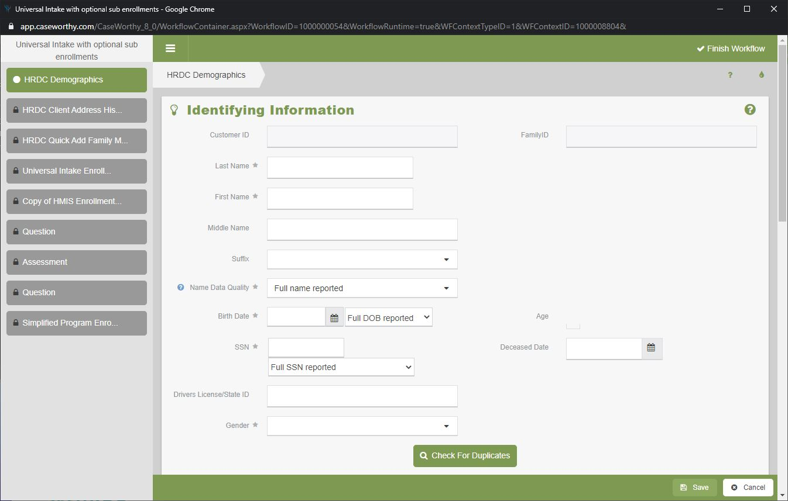

- First, information about the head of household is collected on the [Client Demographics](../Forms/1000000004.md) form. This form contains fields for personal information, like their name, age and gender, as well as some contact and address information. Once all the required fields are complete, click "Save" at the bottom of the form to commit the changes, or "Cancel" if you decide not to. Clicking "Cancel" will end the workflow.

- There is a mandatory duplicate check when you create a record using this form. 

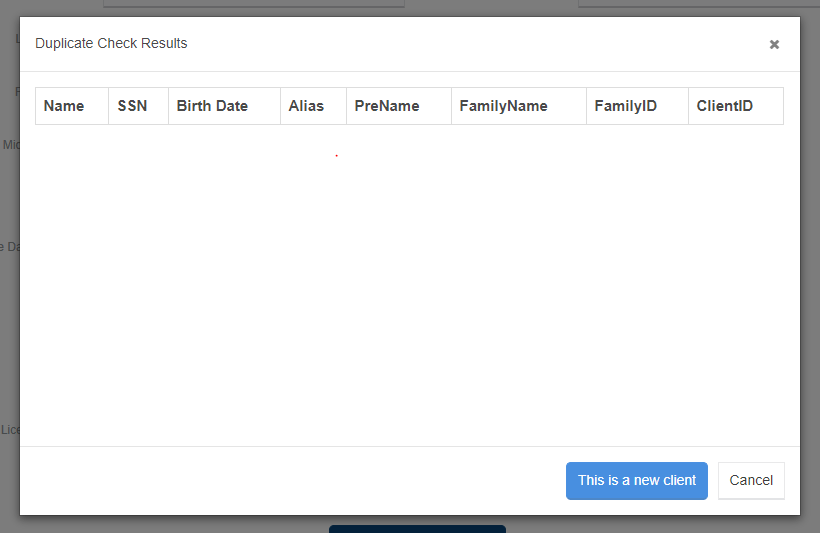

- NOTE: If the client has no address you need to "Make Verify Address not Mandatory". Otherwise their address will be recorded as the Warming Center, which is not accurate.

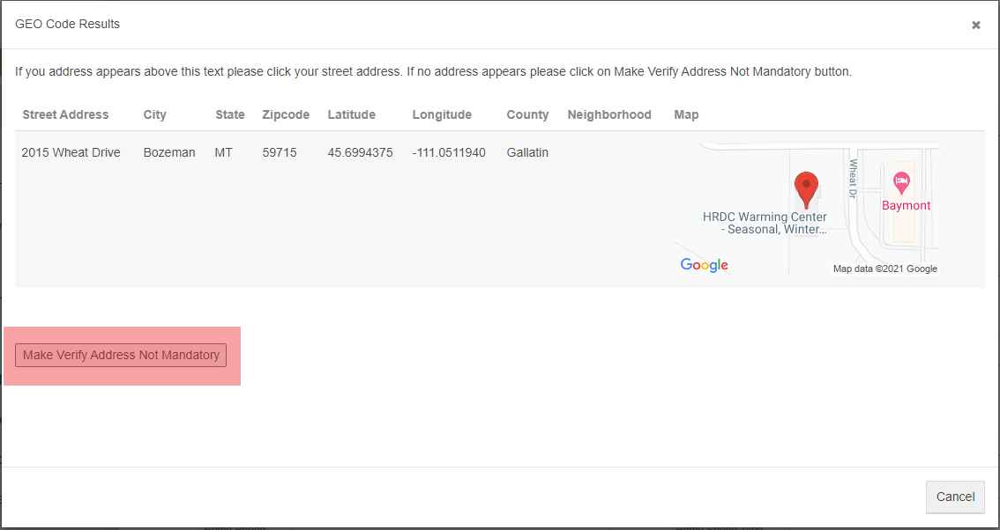

- After saving the client demographics, you will be prompted to update the client [Address History](../Forms/1000000134.md). For brand new clients this is usually limited to adding a mailing address. You only have to enter a mailing address if it is different from their physical address. 
- The next form lets you [Add Family Members](../Forms/1000000131.md). The "+ Add Row" button creates a new set of fields for the personal information of a family member. Each new set of fields also come with its own duplicate check stored procedure, like the one on the first client demographics form.
- The [Universal Intake Enrollment](../Forms/1000000246.md) creates an enrollment for the family we just created. The only field you need to fill is "Program Entry Date". "Intake Completed By" will default to the user entering the data, but it can be changed if somebody is doing data entry on behalf of somebody else.
- The [Enrollment Members](../Forms/1000000259.md) form lets you select which household members will be tied to the enrollment created on the last form. For the Universal Intake enrollment, all household members should be added to the enrollment. Click the checkbox for each family member and verify that the program entry dates are all correct.
- At this point you will be asked: "Complete assessments at this time?" If you have recent data available (which you should for a brand new client) you should say yes. You have the option of saying no and skipping the remaining steps of the intake, but this option should only be used if the complete data is not available and we need some sort of client record in the system. This will leave the enrollment status as "Assessments Pending". To complete them go to the [Program Enrollment](../Forms/1000000266.md) form, and click on the assessments pending link. 

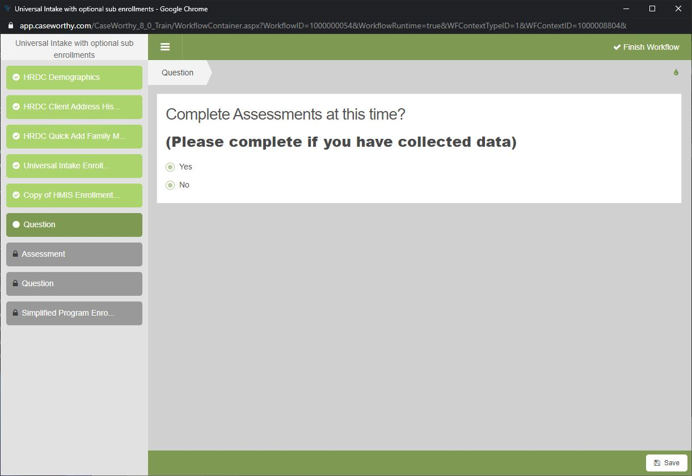

- Once the enrollment is created and all the members are added, the workflow creates an <a href="Objects/Assessment.md" target="_blank">Assessment</a> for each client. The first set of forms you complete will collect Universal Intake data. These are data points that are required by all HRDC programs, including all the housing programs. 
    - The [HUD Assessment](../Forms/1000000248.md) collects data on things like housing status, non-cash benefits received, employment status, and more. You will have to complete the HUD Assessment for each enrolled member, but not all family members will be asked the same questions. 
    - The [Financial Assessment](../Forms/1000000145.md) collects data on household income and its sources. Check each row that applies, enter the amount, and the interval. There are additional fields to record how and when the data was verified, but they are not required.
    
### Additional Programs

 - Once all the assessment data is collected, you will be asked "Would you like to enroll members of this household into any additional programs?" Select "Yes" if you are enrolling a client into housing, homemaker, senior reach, or senior groceries. Some housing programs require additional assessment data for funding and compliance purposes. The supplemental enrollment allows CaseWorthy to record these data. Homemaker, Senior Reach, and Senior Groceries use the program attendance feature, which allows services to be added for multiple clients at the same time.

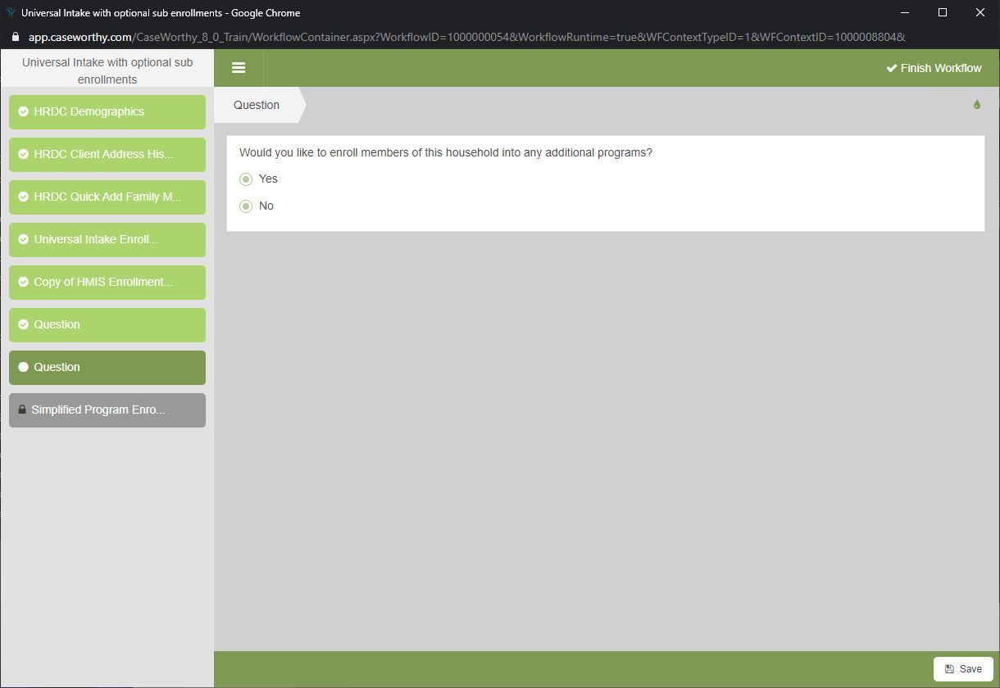

 
 - On the [Enrollment Add/Edit](../Forms/1000000030.md) form select the additional program under the Program dropdown and use the same Program Entry Date that you used for the initial enrollment.
 - You will have to select which family members to enroll again on the [Enrollment Members](../Forms/1000000259.md) form.
 - You will again be asked if you want to complete assessments, say yes. This will create a new set of [Assessments](../Objects/Assessment.md) that will be tied to the additional program enrollment.
 - You may be given the option to Copy Assessments. This will fill in all the data that you already entered for the Universal Intake.
 
 #### Housing
 
 - The [HUD Assessment](../Forms/1000000248.md) may ask for additional data depending on the family.
 - The [Chronic Homelessness](../Forms/1000000262.md) collects more detailed information about the housing status of each family member. Data entered on this form determines if a client meets the HUD definition for chronic homelessness.
 - There are no additional questions on the [Financial Assessment](../Forms/1000000145.md), but you may be prompted to enter data on additional family members.
 
 #### Homemaker, Senior Reach, Senior Groceries
 
 These programs only collect data from the HUD Assessment and the Financial Assessment. There are no additional program specific data points.

---
---

## Existing Clients 
[\[Back to Top\]](#table-of-contents)

If you need to enroll a client or family that already exists in CaseWorthy the process is much simpler. Click the "Intake: Existing Clients" button on the left navigation bar. This launches a shorter workflow that focuses on enrollment and assessment data, and skips collecting some of the more general client demographics.

1. On the [Enrollment Add/Edit](../Forms/1000000030.md) form select the program you are enrolling the client in.
1. Select which family members to enroll on the [Enrollment Members](../Forms/1000000259.md) form.
1. At this point you will be asked: "Complete assessments at this time?" If you have recent data available you should say yes. You have the option of saying no and skipping the remaining steps of the intake, but this option should only be used if the complete data is not available and we need some sort of client record in the system. This will leave the enrollment status as "Assessments Pending". To complete them go to the [Program Enrollment](../Forms/1000000266.md) form, and click on the assessments pending link. already entered for the Universal Intake.
1. Once the enrollment is created and all the members are added, the workflow creates an <a href="Objects/Assessment.md" target="_blank">Assessment</a> for each family member. The required assessments will vary based on the program.
   
1. The workflow ends when all of the assessments are completed. Click "Done" when you are finished reviewing the summary of the forms you filled out.

---
---

## Assessments 
[\[Back to Top\]](#table-of-contents)

An Assessment is simply a collection of data made by a specific program on a specific date. The assessments that you completed as part of the intake process are known as "At Entry" assessments, but there are also "During", "At Exit", and "Annual" assessments. To review a client's assessment history use the [Assessment Summary](../Forms/1000000256.md) form from the left navigation bar. This form displays the date of the assessment, the assessment type, who collected the information, and for which program it was collected. Clicking the Action Gear on a row will allow you to review responses to specific assessment questions.

- The [HUD Assessment](../Forms/1000000248.md) collects data on things like housing status, non-cash benefits received, employment status, and more. You will have to complete the HUD Assessment for each enrolled member, but not all family members will be asked the same questions. 
- The [Financial Assessment](../Forms/1000000145.md) collects data on household income and its sources. Check each row that applies, enter the amount, and the interval. There are additional fields to record how and when the data was verified, but they are not required.
- The [Chronic Homelessness](../Forms/1000000262.md)" collects more detailed information about the housing status of each family member. Data entered on this form determines if a client meets the HUD definition for chronic homelessness.

### Updating Client Assessments

It is important to regularly update our client data. It is a good rule of thumb to keep the data less than 6 months old. You can quickly identify if a client's data is older than that by the color coded Most Recent Assessment dashboard widget.

You can create a new assessment from the assessment summary form by clicking the "+ Add New" button in the top-right corner. This will launch the [New Assessment](../Forms/1000000267.md) form. Select the program and assessment type, enter the date, and hit "Save". You will be directed to fill out the [HUD Assessment](../Forms/1000000248.md) form, but you will have to go back to the assessment summary form to fill in values for the other assessment forms.

---
---

## Household Composition Changes 
[\[Back to Top\]](#table-of-contents)

Sometimes clients need to be removed from one household and added to another. This process is handled by a CaseWorthy super user.  You can find additional instructions on household composition changes in the admin instructions [here](cwadmin.md).

---
---

## Case Management Tools 
[\[Back to Top\]](#table-of-contents)

Outside of the intake process, there are several other case management tools available in CaseWorthy. Below is a brief overview of some of the most commonly used features.

### Case Notes

Case notes can be accessed through the Case Management menu on the left-nav bar. The [case note summary]() form displays all the case notes for the active client. You can filter which types of case notes are displayed. You can select one or more case notes using the checkboxes on the left side, and click print selected to export all of them into a single document. Click "Add New" in the upper right corner to create a new case note.

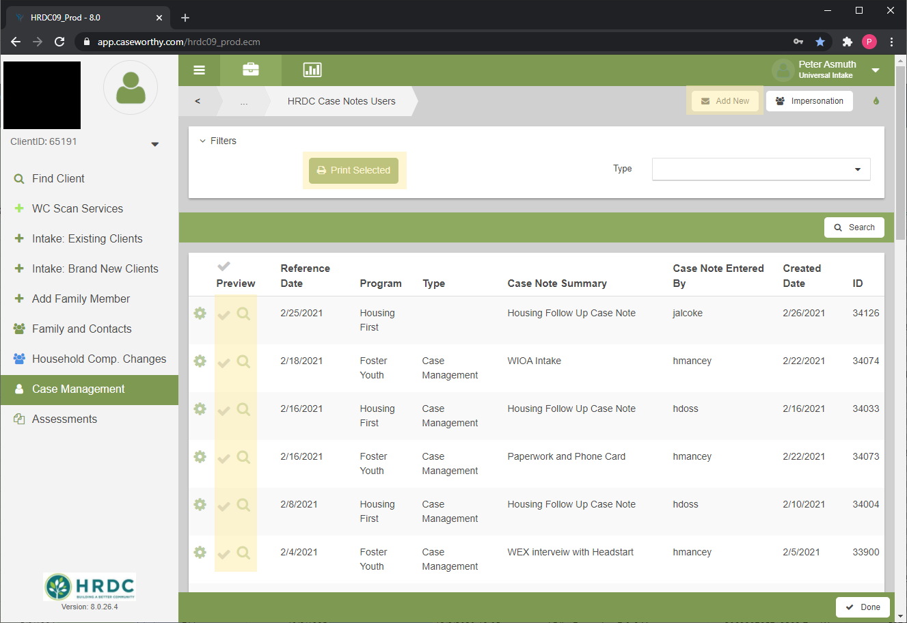

---

### Services

There are two places to access a client's service history. If you click the family drop-down arrow in the top-left, it will reveal the demographics and services buttons. You can also find it in the Case Management menu on the left-nav bar.

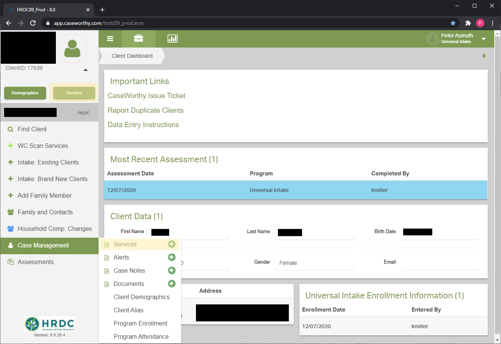

Both of these buttons will take you to the [Services Summary](../Forms/1000000252.md) form. This form displays one row for each service received by the client. The columns display the date of the service, the program providing the service, the service type, the service total, and which user entered the service. In the upper right corner of the form there is a link that allows you to add new services.

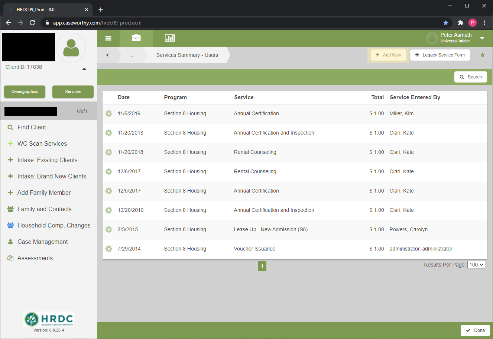

Clicking the "+ Add New" button brings you to the [Add Services - Universal Intake](../Forms/1000000231.md) form. The program drop down lets you choose which program to provide the service under. Once a program is selected, the service types available to that program will be displayed. Check the checkbox on the left to provide that type of service. Provide the start date, end date, and service quantity. Only one service per service type can be added on one form submission. Submit the form and reload it to give multiple services of the same type.

### Alerts

Alerts are used to provide important client information to users at a glance. Alerts are used mostly to highlight data quality issues and inform staff of clients that may be banned from HRDC services and locations. Alerts appear on the client dashboard

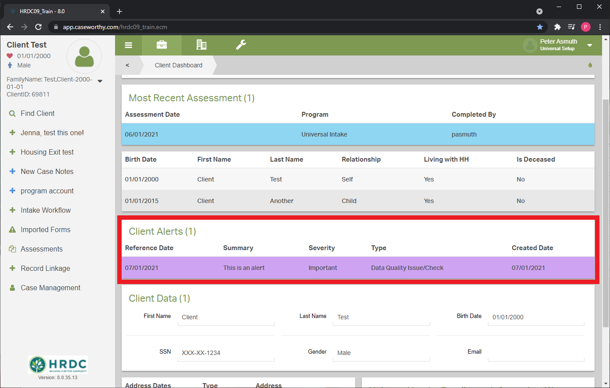

To create a new alert for a client, use the [Add/Edit Client Alert](../Forms/1000000197.md) form (Case Management -> Alerts -> Add New). This form allows users to create alerts of different types for a client. Each alert requires a summary, severity, type, and date.

Change the status of the alert from open to closed when it is no longer relevant. 

### Documents

Upload documents through the [Document Check](../Forms/1000000271.md) form (Case Management -> Documents -> Add New). Select one or more document types to be uploaded. For each document type, click browse and find the document locally on your computer. Click save when you attach all the documents.

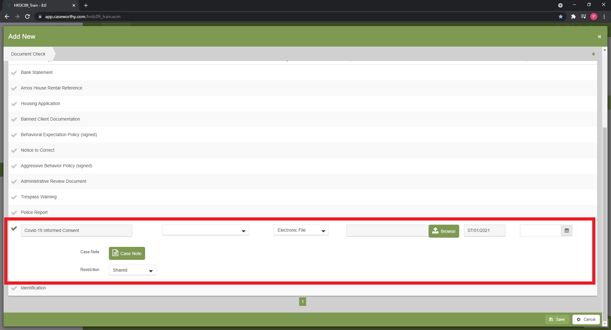

- Program Enrollment

### Program Attendance

The [Program Attendance](../Forms/1000000140.md) form allows users to add services for multiple clients on the same date. This functionality is currently used by Homemaker, Senior Reach, and Senior Groceries. Set the service date, quantity, program, and service type. Clients with open enrollments in the selected program will appear in the list. Check each client that received that service on that day. You can edit the quantity for each client receiving a service, but the default value will be the on set at the top of the form.

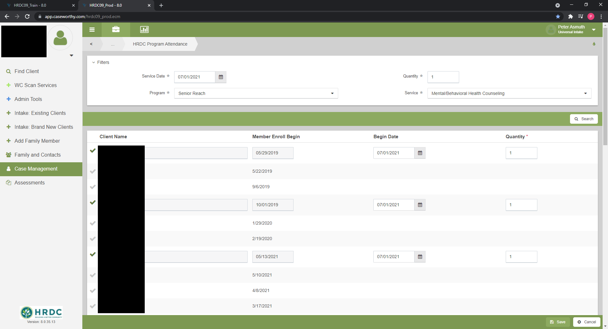

## Universal Intake Enrollment
[\[Back to Top\]](#universal-intake-enrollment)

When trying to add a service to a client if you are running into the issue of not having a Universal Intake EnrollmentID there are two different paths that may fix the issue. Begin by navigating to the head of household then to Case management- Program Enrollment. This will populate a list of programs if Universal Intake is on the list click the action gear and then member. In the top right you will click Add/Edit Members. You will then click all the check marks beside clients until they are all green.
[Universal Intake Enrollment]()
If Universal Intake was not on the list under Case Management - Program Enrollment then click Intake: Existing Clients and add universal Intake. Ensure that you add all family members as well by clicking the check mark green on the next page. 

   

